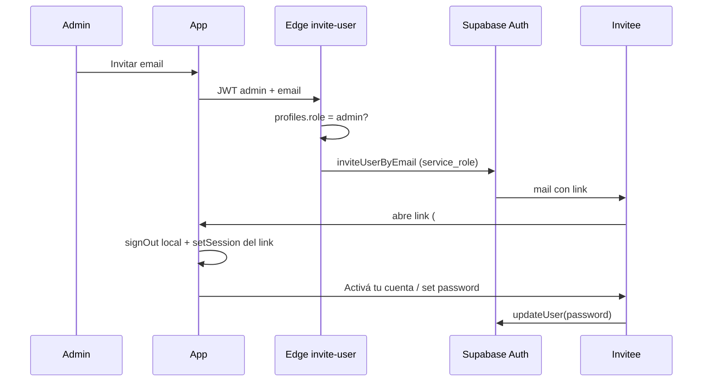

# Seguridad — estado e implementación

Documento vivo. Actualizar cuando cambie auth, RLS, invites o políticas.

## Principios

1. El frontend **nunca** lleva `service_role` ni secretos de admin.
2. La autorización real está en **Postgres RLS** (+ constraints).
3. Operaciones privilegiadas van en **Edge Functions** (Deno) con `service_role` solo en el runtime de Supabase.
4. Signup público desactivado; altas solo por invitación de admin.
5. Modo local no es modelo de seguridad multi-usuario.
6. Links de invite/recovery **no** deben reutilizar la sesión de otro usuario en el mismo navegador.

---

## Flujo auth (implementado)



### Reglas anti-confusión de sesión

- `detectSessionInUrl: false`; el consumo es manual en `src/lib/authLink.ts`.
- Ante tokens de invite/recovery: `signOut({ scope: 'local' })` y después `setSession` / `exchangeCodeForSession`.
- `?set-password=1` **solo** activa el flujo si el tab marcó `sessionStorage` al consumir el link (evita que un admin con esa query se auto-cambie la clave).
- Tras set password: limpiar marca + query + hash.

### Roles

- Admin seed: `bfd18782-7bea-4386-bd8f-de050f398aec` (`005_admin_invites.sql`).
- Invites: **cualquier email válido** (Gmail, Camposur, etc.); el control es solo-admin.
- `profiles.role` protegido por trigger (no auto-promoción).

### Contraseñas

- Mín. 8, máx. 128, letra + número, sin espacios extremos (`assertCloudPassword`).
- UI: set-password + “Olvidé mi contraseña”.
- Alinear también en Supabase Dashboard (mínimo de contraseña).

### Edge Function `invite-user`

- Verifica JWT + `role=admin`.
- `redirectTo` solo `https://*` o `http://localhost|127.0.0.1`.
- Sin `service_role` en el cliente.

### RLS / DB

- Migraciones `001`–`006` aplicadas (RLS + hardening + CHECKs).
- Admin **no** lee calendarios ajenos; solo gestiona altas.

---

## Tests de seguridad

```bash
npm test
```

Cubren:

- `src/lib/security.test.ts` — password, email invite, sanitización, ids/tokens.
- `src/lib/authLink.test.ts` — no pisar admin con `?set-password=1`, consume invite hash, PKCE code, redirects seguros.
- `src/components/Auth/LoginPage.test.tsx` — cloud sin registro público + forgot password.

---

## Checklist operativo (manual)

- [x] Migraciones 005/006 en SQL Editor
- [x] Edge Function desplegada
- [x] Signup público desactivado
- [x] Cloudflare Pages + secrets
- [ ] Probar invite en **incógnito** / perfil sin sesión admin
- [ ] Custom domain `calendario.bmatrix.org` Active
- [ ] Dashboard: password min 8 + letra/número si está disponible

## Deuda menor (no bloqueante)

- CORS de la Edge Function en `*` (aceptable; se puede acotar a orígenes conocidos).
- Cloudflare Access (opcional, después).
- Rate limit de invites por admin/día (nice-to-have).
