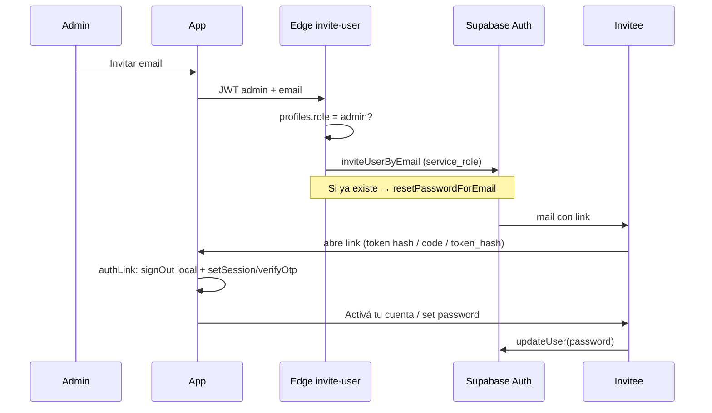

# Seguridad — estado e implementación

Documento vivo. Actualizar cuando cambie auth, RLS, invites o políticas.

## Principios

1. El frontend **nunca** lleva `service_role` ni secretos de admin.
2. La autorización real está en **Postgres RLS** (+ constraints).
3. Operaciones privilegiadas van en **Edge Functions** (Deno) con `service_role` solo en el runtime de Supabase.
4. Signup público desactivado; altas solo por invitación de admin.
5. Modo local no es modelo de seguridad multi-usuario.
6. Links de invite/recovery **no** deben reutilizar la sesión de otro usuario en el mismo navegador.

---

## Flujo auth (implementado)



### Piezas de código

| Pieza | Rol |
|-------|-----|
| `src/lib/authLink.ts` | Consume invite/recovery; no pisa sesión admin |
| `src/lib/invite.ts` | Llama Edge Function; parsea error real (`FunctionsHttpError`) |
| `src/context/AuthContext.tsx` | Sesión, set-password, forgot, `authLinkError` |
| `supabase/functions/invite-user` | Solo admin; invite o reenvío recovery |

### Reglas anti-confusión de sesión

- `detectSessionInUrl: false`; consumo manual en `authLink.ts`.
- Ante tokens: `signOut({ scope: 'local' })` → `setSession` / `exchangeCodeForSession` / `verifyOtp`.
- Soporta: `#access_token`, `?code=`, `?token_hash=&type=`.
- `?set-password=1` solo con marca en `sessionStorage` (si no → mensaje de enlace incompleto, no cambia clave del admin).
- Probar invites en **incógnito** / sin sesión admin.

### Roles

- Admin seed: `bfd18782-7bea-4386-bd8f-de050f398aec`.
- Invites: **cualquier email válido** (Gmail, Camposur, etc.).
- `profiles.role` protegido por trigger.
- Borrar usuarios: solo Dashboard Supabase → Authentication → Users (cascade borra datos).

### Contraseñas

- Mín. 8, máx. 128, letra + número (`assertCloudPassword`).
- UI: Activá tu cuenta / Restablecé + “Olvidé mi contraseña”.

### Links de mail — troubleshooting

| Síntoma | Causa probable | Qué hacer |
|---------|----------------|-----------|
| Abre login normal sin set-password | Site URL en dominio no Active / tokens gastados | Site URL = `bmx-calendario.pages.dev`; nuevo mail en incógnito |
| `email rate limit exceeded` | Límite free de Supabase Auth emails | Esperar 30–60 min; un solo reenvío |
| `Edge Function returned a non-2xx` | Error real oculto (ya se parsea) | Ver mensaje en UI; user ya existe → recovery |
| Cambia clave del admin | Sesión admin + link invite (bug viejo) | Ya mitigado con `authLink`; usar incógnito |

**URL Configuration recomendada (mientras custom domain Verifying):**

- Site URL: `https://bmx-calendario.pages.dev`
- Redirect URLs: `https://bmx-calendario.pages.dev/**`, `https://calendario.bmatrix.org/**`, `http://localhost:5173/**`

### Edge Function `invite-user`

- JWT + `role=admin`.
- Invite nuevo; si “already registered” → `resetPasswordForEmail`.
- `redirectTo`: `https://*` o `http://localhost|127.0.0.1`.
- Redeploy: `npx supabase functions deploy invite-user --project-ref hznvsuobulrxxpofebkq`

### RLS / DB

- Migraciones `001`–`006` aplicadas.
- Admin no lee calendarios ajenos; solo gestiona altas.

---

## Tests

```bash
npm test
```

- `security.test.ts` — password, emails, sanitización.
- `authLink.test.ts` — sesión, token_hash, PKCE, errores URL, set-password stale.
- `LoginPage.test.tsx` — cloud sin signup público.

---

## Checklist operativo

- [x] Migraciones 005/006
- [x] Edge Function deployada (invite + recovery resent)
- [x] Signup público off
- [x] Cloudflare Pages live
- [ ] Site URL = host que responde hoy (`pages.dev` hasta Active)
- [ ] Invite OK en incógnito (pendiente cooldown rate limit)
- [ ] `calendario.bmatrix.org` Active → actualizar Site URL
- [ ] Rotar tokens pegados en chat

## Deuda menor

- CORS Edge Function `*`.
- Cloudflare Access (después).
- Rate limit propio de invites (nice-to-have; hoy manda Supabase free).
- UI admin para borrar usuarios (hoy solo Dashboard).
