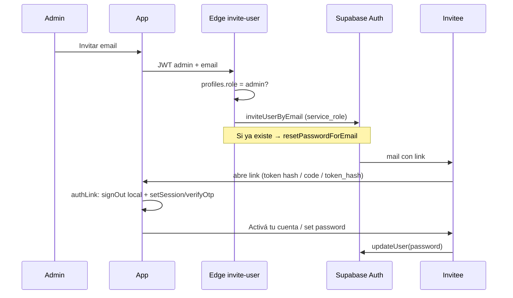

# Seguridad — estado e implementación

Documento vivo. Actualizar cuando cambie auth, RLS, invites o políticas.

## Principios

1. El frontend **nunca** lleva `service_role` ni secretos de admin.
2. La autorización real está en **Postgres RLS** (+ constraints).
3. Operaciones privilegiadas van en **Edge Functions** (Deno) con `service_role` solo en el runtime de Supabase.
4. Signup público desactivado; altas solo por invitación de admin.
5. Modo local no es modelo de seguridad multi-usuario.
6. Links de invite/recovery **no** deben reutilizar la sesión de otro usuario en el mismo navegador.

---

## Flujo auth (implementado)


```mermaid
sequenceDiagram
  participant Admin
  participant App
  participant Edge as Edge invite-user
  participant SB as Supabase Auth
  participant Invitee

  Admin->>App: Invitar email
  App->>Edge: JWT admin + email
  Edge->>Edge: profiles.role = admin?
  Edge->>SB: inviteUserByEmail (service_role)
  Note over Edge,SB: Si ya existe → resetPasswordForEmail
  SB->>Invitee: mail con link
  Invitee->>App: abre link (token hash / code / token_hash)
  App->>App: authLink: signOut local + setSession/verifyOtp
  App->>Invitee: Activá tu cuenta / set password
  Invitee->>SB: updateUser(password)
```

### Piezas de código

| Pieza | Rol |
|-------|-----|
| `src/lib/authLink.ts` | Consume invite/recovery; no pisa sesión admin |
| `src/lib/invite.ts` | Llama Edge Function; parsea error real (`FunctionsHttpError`) |
| `src/context/AuthContext.tsx` | Sesión, set-password, forgot, `authLinkError` |
| `supabase/functions/invite-user` | Solo admin; invite o reenvío recovery |

### Reglas anti-confusión de sesión

- `detectSessionInUrl: false`; consumo manual en `authLink.ts`.
- Ante tokens: `signOut({ scope: 'local' })` → `setSession` / `exchangeCodeForSession` / `verifyOtp`.
- Soporta: `#access_token`, `?code=`, `?token_hash=&type=`.
- `?set-password=1` solo con marca en `sessionStorage` (si no → mensaje de enlace incompleto, no cambia clave del admin).
- Probar invites en **incógnito** / sin sesión admin.

### Roles

- Admin seed: `bfd18782-7bea-4386-bd8f-de050f398aec`.
- Invites: **cualquier email válido** (Gmail, Camposur, etc.).
- `profiles.role` protegido por trigger.
- Borrar usuarios: solo Dashboard Supabase → Authentication → Users (cascade borra datos).

### Contraseñas

- Mín. 8, máx. 128, letra + número (`assertCloudPassword`).
- UI: Activá tu cuenta / Restablecé + “Olvidé mi contraseña”.

### Links de mail — troubleshooting

| Síntoma | Causa probable | Qué hacer |
|---------|----------------|-----------|
| Abre login normal sin set-password | Site URL en dominio no Active / tokens gastados | Site URL = `calendario.bmatrix.org` (o pages.dev); nuevo mail en incógnito |
| `URL de redirección inválida` al invitar desde escritorio | Tauri usa `http://tauri.localhost` como origin | Ya se usa `VITE_PUBLIC_APP_URL` o `https://calendario.bmatrix.org`; actualizar app |
| `email rate limit exceeded` | Límite free de Supabase Auth emails | Esperar 30–60 min; un solo reenvío |
| `Edge Function returned a non-2xx` | Error real oculto (ya se parsea) | Ver mensaje en UI; user ya existe → recovery |
| Cambia clave del admin | Sesión admin + link invite (bug viejo) | Ya mitigado con `authLink`; usar incógnito |

**URL Configuration (dominio Active):**

- Site URL: `https://calendario.bmatrix.org`
- Redirect URLs: `https://calendario.bmatrix.org/**`, `https://bmx-calendario.pages.dev/**`, `http://localhost:5173/**`
- Allowlist de código (cliente + Edge `invite-user`): esos hosts. Se rechaza `https://localhost`, `capacitor://`, `tauri.localhost` y cualquier otro `https`.

### Edge Function `invite-user`

- JWT + `role=admin`.
- Invite nuevo; si “already registered” → `resetPasswordForEmail`.
- `redirectTo`: allowlist (`calendario.bmatrix.org`, `bmx-calendario.pages.dev`, `http://localhost:5173`). No cualquier `https:`.
- Código de allowlist **ya está en el repo**; el runtime de Supabase **sigue con la función vieja** hasta redeploy: `npx supabase functions deploy invite-user --project-ref hznvsuobulrxxpofebkq`.

### RLS / DB

- Migraciones `001`–`007` (aplicar `007_work_week_settings.sql` en proyectos que aún no la tengan).
- Admin no lee calendarios ajenos; solo gestiona altas.
- `work_week_settings`: 1 fila por usuario; RLS select/insert/update/delete own; trigger exige que `work_calendar_id` (si no null) pertenezca al mismo `user_id`.

### Respaldos JSON (export / import)

- Export: blob local + nombre sanitizado (`backupFilename`); sin path traversal.
- Import: remapeo de IDs (`remapBackupForImport`) + RLS; no se puede escribir en datos ajenos.
- Límites DoS: archivo ≤ **5 MB** (`assertBackupFileWithinLimit` antes de leer); máx. **5000** eventos, **5000** excepciones, **10000** task runs (`calendarBackup.ts`).

---

## Tests

```bash
npm test
```

- `security.test.ts` — password, emails, sanitización, CSP no se aplica en Capacitor.
- `authLink.test.ts` — sesión, token_hash, PKCE, allowlist de redirects (Capacitor/Tauri).
- `nativeReminders.test.ts` — tope 100, sin descripción/HTML, extras validados, defer laboral.
- `mobileConfig.security.test.ts` — sin `service_role` en config; `allowBackup=false`.
- `calendarBackup.test.ts` — export/import, topes de tamaño y arrays.
- `LoginPage.test.tsx` — cloud sin signup público.

---

## Checklist operativo

- [x] Migraciones 005/006
- [x] Edge Function deployada (invite + recovery resent)
- [x] Signup público off
- [x] Cloudflare Pages live
- [x] `calendario.bmatrix.org` Active
- [x] Site URL = `https://calendario.bmatrix.org` (verificar en dashboard si hay fallos de mail)
- [x] Invite OK desde navegador; escritorio usa redirect público (v1.0.8+)
- [x] Baseline primeros usuarios **v1.1.0**
- [x] Allowlist Auth en cliente (v1.2.0, `main`)
- [ ] Redeploy `invite-user` con la misma allowlist
- [ ] Checklist manual APK (abajo)
- [ ] Rotar tokens pegados en chat (si aplica)
- [ ] (Opcional) Cloudflare Access

## Móvil (Capacitor)

- APK sideload: misma clave **anon** que web (pública). Nunca `service_role` en `android/`, `ios/`, `capacitor.config.ts` ni `VITE_*`.
- `android:allowBackup="false"` + network security sin cleartext. WebView debug off en release.
- Notificaciones: canal `PRIVATE`; extras validados (`isSafeId` / `isSafeIsoDate`); sin descripción en el texto visible.
- Superficie nativa mínima: App, Keyboard, StatusBar, LocalNotifications. Sin custom URL scheme de Auth en v1.
- Logout de la app borra la sesión del WebView.

### Checklist manual APK (pendiente — no corrida aún)

- Invite desde la APK (admin) → el mail apunta a `calendario.bmatrix.org`, no a localhost.
- Logout; otro usuario en el mismo teléfono no hereda la cuenta.
- Lock screen no muestra la descripción del evento.
- Spot-check del APK (`strings`) sin `service_role`.
- Aviso con la app cerrada / en segundo plano (y tras reboot, abrir una vez).

## Deuda menor

- CORS Edge Function `*`.
- Cloudflare Access (después).
- Rate limit propio de invites (nice-to-have; hoy manda Supabase free).
- UI admin para borrar usuarios (hoy solo Dashboard).
